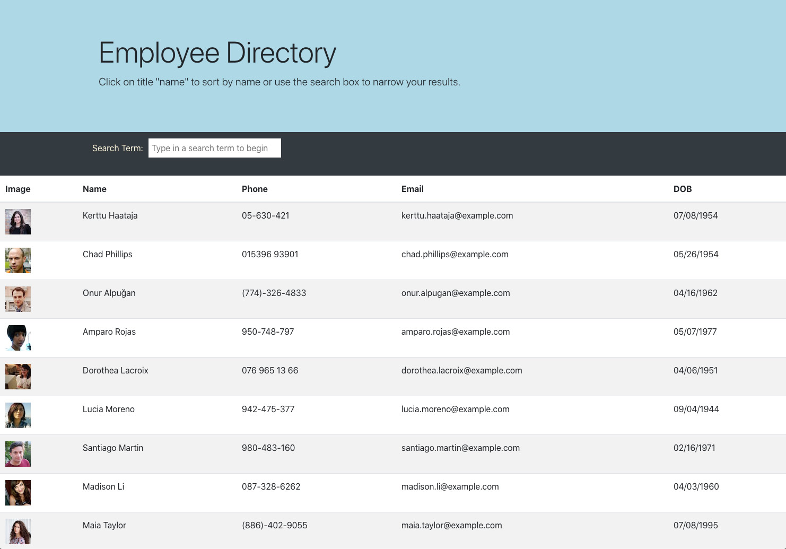

# Employee Directory

Allows the user to view employees, search through list of employees, and sort the list of employees. 

## Description

The Employee Directory uses React to control elements of the front-end. 

## Livesite:

[application](https://pmhagwood.github.io/employee-directory/)

## Images

## Installation

You will need to npm init to get all the required node modules. If you are running the code locally the local host is set to port 3000. Run npm start to launch the application

## Usage

The project is to learn and use React and to work with a front end application for React. The project could be used to list employees or similar API calls.

## Credits

The project built completely from scratch and I did all the code and development.  

## Challenges

React is a very challenging and powerful library to learn. I feel like I was able to learn and grow through the development of this application. 